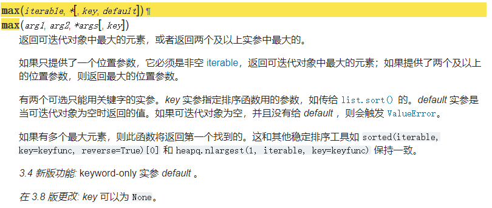
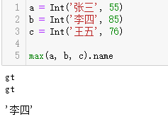

# S系列·Python中的数字比较与类

S又称水，亦可读作Small，在日常工作学习过程中，偶尔会发现之前没有看见的、小的、有趣的操作，或许这些操作对于当下的问题解决并无意义，仍然想记录下来，或许能以单独写成一篇完整的文章，则作为流水账似的记下。

系列文章说明：

> S系列·<<文章名称>>

**平台：**

- windows 10.0

- python 3.8

## 问题简述

近期看到这么一个问题，有把值分别赋值给不同的变量，想在比较大小后得到变量的名称。  

```python
a = 34
b = 55
c = 12
d = 55

max(a, b, c)  # 期望得到'b'
```

在该例子中，有过使用python经历的读者会知道，max处理后的结果只能返回b所指代的值，即55。而如何得到这个字符串'b'呢？  

## 一个想法

想获取变量名绝非难事，在全局中可以用globals()获取，局部可以用locals()，在这里的难点可能在于，知道a,b,c三者之间的最大值是55，由于globals()会将所有的变量及对应的值返回，在遍历匹配中可能会返回没有参与大小比较的d变量，在实际使用上也不优雅。  

有一定经验的pythoner会选择另辟蹊径，获取值比获取变量更优雅，也更容易，将当初想设置成的变量，转换为值，与原值对应，比如字典的键值对，列表等。  

```python
dict1 = {'a': 34, 'b': 55, 'c': 12}
list1 = [('a', 34), ('b', 55), ('c', 12)]
```

在这样的思考过程中，是不是可以用类来得到这样的结果，将名称和值作为类的属性，比较大小后返回最大值对应的名称，类的结构如下：  

```python
class Int:

    def __init__(self, name, value):
        assert isinstance(name, (str, int, float, tuple)), 'name值应该为不可变对象！'
        self.name = name
        assert isinstance(value, (int, float)), 'value值应该为数字！'
        self.value = value

    def __eq__(self, other):
        print('eq')
        return self.value == other.value

    def __gt__(self, other):
        print('gt')
        return self.value > other.value

    def __ge__(self, other):
        print('ge')
        return self.value >= other.value

    def __lt__(self, other):
        print('lt')
        return self.value < other.value

    def __le__(self, other):
        print('le')
        return self.value <= other.value
```

定义一个类，并设置大小比较的魔法方法，等于，大于，大于等于，小于，小于等于。当值之间进行比较时，比如使用==，>, ...就会调用这些魔法方法。  

在写下这篇之前，没有去探究max函数的处理逻辑，是通过魔法函数实现比较，还是其他的方式，对此翻了下官方说明。  

  

看了后好像也不能理解具体用的啥，本人愚钝，没有去看c源码，尝试直接将几个类实例传入到max中，可以看到打印出多个gt，可以大概猜测实现逻辑，通过遍历传入的值，逐个比较，如max是多次使用>，调用\_\_gt\_\_魔法方法。  

  

不难看出，每次都会比较判断，返回布尔值，通过比较结果来选取哪一个值与下一个值进行比较，回到问题上，如果有多个值需要比较，且部分跟比较的值有相同的value不参与比较，仍然可以返回出对应的值，只要将需要比较的值传入到max中，当然如果有value相同的值进行比较，不会将两个值同时返回。使用类来解决，整个结构上更为优雅，整个的工作流程也很顺畅。  

## 总结

近期的一些认识，为什么要返回变量名，使用变量名的目的是什么，能不能将变量名转换到值上来，大多时候，定义一个变量也是为了能更好的使用其引用的值，而有时可能让变量绊了自己的脚，则需要考虑变量与值的关系，以及结构。  

-妄图设计，却凌乱万分。-  

---

<p align="right">2020.7.21留</p>
