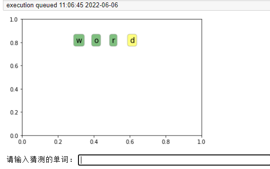
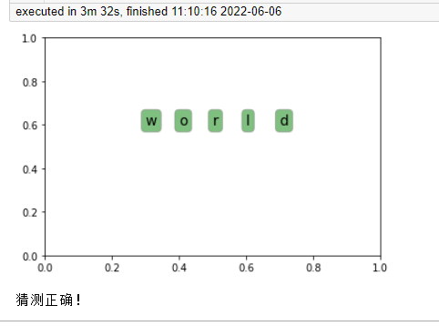
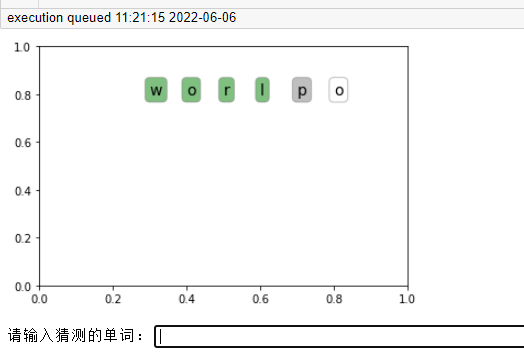
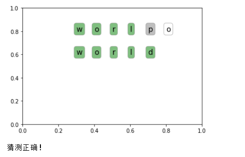

# S系列·在已作出的matplotlib图中新增图例

S又称水，亦可读作Small，在日常工作学习过程中，偶尔会发现之前没有看见的、小的、有趣的操作，或许这些操作对于当下的问题解决并无意义，仍然想记录下来，或许能以单独写成一篇完整的文章，则作为流水账似的记下。

系列文章说明：

> S系列·<<文章名称>>

**平台：**

- windows 10.0

- python 3.8

- matpoltlib 3.3.4

## 目的

想写一个实现猜单词的代码，每次猜测结果与目标单词进行比较，并将结果用matplotlib作图模块呈现出来，如果对应位置且字母一致，该位置单词以绿底显示，如果字母在目标单词中但是位置不对，用黄底填充，如果猜测单词长度超过目标单词，超过部分均以白底填充，对于不在目标单词中的字母，用灰底填充。在此基础上，每次猜测的结果是显示在上一次猜测值的下方，且保留上一次猜测的结果，类似于涂鸦板。  

## 处理方法

1. 暂不考虑保留上次结果  

```python
from collections import Counter
from itertools import zip_longest
import matplotlib.pyplot as plt
from IPython.display import clear_output

def show_string(fig, x=0.3, y=0.8, string_list=None):
    # x：横坐标，y：纵坐标
    clear_output()  # 每次作图前清空已打印的数据
    if not string_list:
        return fig
    for s, fc in string_list:
        bbox_props = dict(boxstyle="round", fc=fc, ec="0.5", alpha=0.5)
        plt.text(x, y, s, size=14, bbox=bbox_props)
        x += 0.1
    return fig

def word_color(pat, repl):
    # 为每个字母标记颜色
    pat_count = Counter(pat)
    for x, y in zip_longest(pat, repl):
        if not (x and y):
            yield (y, 'white')
        elif x == y:
            pat_count[y] -= 1
            yield (y, 'green')
        elif y in pat and pat_count.get(y, 0) > 0:
            yield (y, 'yellow')
        else:
            yield (y, 'gray')


if __name__ == '__main__':
    fig = plt.figure()
    answer = 'world'  # 需要猜测的目标单词
    y = 0.8
    while True:
        result = input('请输入猜测的单词：')
        fig = show_string(fig, y=y, string_list=word_color(answer, result))
        y -= 0.2
        plt.show()
        if result == answer:
            print('猜测正确！')
            break
```

`Counter`来统计字母频数，如果正确出现的字母已显示完，后续相同字母应该用灰底填充。`zip_longest`类似于内置的`zip`函数，不同处为`zip`取较短迭代器的长度，`zip_longest`取较长的长度，短的迭代器不足部分默认以`None`填充，使用`fillvalue`参数可以更改空值的填充值。`cleart_output`，该实例在`jupyter`中运行，每次作图前会清空该单元格之前已打印过的数据或者图像。  

假设本次需要猜测的目标单词是world，以下为猜测两次的显示结果：  

  

  

可以看到，两次显示是独立的，在matplotlib作图中，在plt.show()显示完毕后，之前定义的fig对象就为空，如果想直接显示两个图像，会在plt.show之前将两者放在同一张图中，如此处的字母绘制，遍历每个字母列表，逐个的显示在图像中，而猜测过程中，不能提前得知猜测的是何值，则不能在plt.show之前将后续猜测的值显示出来，在matplotlib中有这种调取上一次显示的结果的方法，通过画图管理器将本次的结果显示在上一张图像中。  

- 在上一张图中叠加此次的结果  

```python
from collections import Counter
from itertools import zip_longest
import matplotlib.pyplot as plt
from IPython.display import clear_output

def show_string(fig, x=0.3, y=0.8, string_list=None):
    # x：横坐标，y：纵坐标
    clear_output()  # 每次作图前清空已打印的数据
    if not string_list:
        return fig
    # --- 调用图像管理器
    fm = plt.get_current_fig_manager()
    fm.canvas.figure = fig
    fig.canvas = fm.canvas
    # ------------------
    for s, fc in string_list:
        bbox_props = dict(boxstyle="round", fc=fc, ec="0.5", alpha=0.5)
        plt.text(x, y, s, size=14, bbox=bbox_props)
        x += 0.1
    return fig

def word_color(pat, repl):
    # 为每个字母标记颜色
    pat_count = Counter(pat)
    for x, y in zip_longest(pat, repl):
        if not (x and y):
            yield (y, 'white')
        elif x == y:
            pat_count[y] -= 1
            yield (y, 'green')
        elif y in pat and pat_count.get(y, 0) > 0:
            yield (y, 'yellow')
        else:
            yield (y, 'gray')


if __name__ == '__main__':
    fig = plt.figure()
    answer = 'world'  # 需要猜测的目标单词
    y = 0.8
    while True:
        result = input('请输入猜测的单词：')
        fig = show_string(fig, y=y, string_list=word_color(answer, result))
        y -= 0.2
        plt.show()
        if result == answer:
            print('猜测正确！')
            break
```

与上一代码不同处仅在于，在绘制图像时，将已存在的图像`fig`对象，作为当前的绘图对象。以下为猜测两次的显示结果：  

  

  

在第二次输入猜测值后，显示的结果出现在上一张图中。  

## 总结

本例代码运行在jupyter编辑器，如在其他编辑器不能执行，请将IPython模块提及的相关函数，本例中为clear_output()注释或者删除。通过简短的示例演示，将后续需要显示的图像显示在已经plt.show()的图像中，避免了多次绘图或者添加中间变量。  

得天朗气清，飒爽英姿。  

----

<p align="right">2022.6.6留</p>
